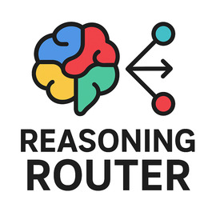
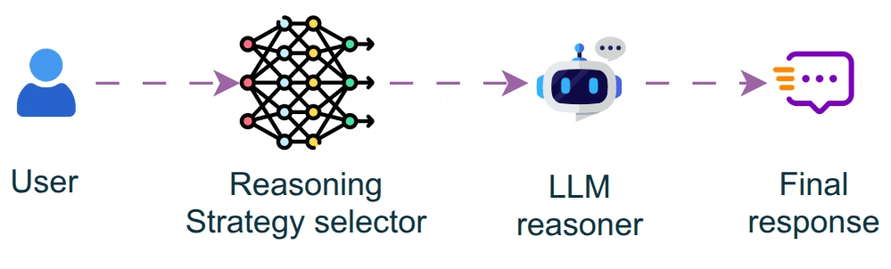

<!-- $ convert logo_large.png -resize 270x270 project_logo.jpg -->

# Reasoning Router: Dynamic Multi-Strategy Reasoning for Robust Multi-Step Problem Solving

[]()
[]()
[]()
[]()
[]()
[]()
[](./LICENSE.md)

## 🚀 Revolutionize Your AI Reasoning: Unlock Superior Performance with Adaptive Strategy Selection

**Imagine an LLM that thinks differently based on the problem at hand.** Introducing **Reasoning Router**, the groundbreaking framework that dynamically selects the optimal reasoning strategy for complex problem-solving tasks. Powered by LangGraph's multi-agent orchestration, this system delivers **measurable accuracy improvements** over traditional single-strategy approaches, transforming how AI tackles diverse challenging problems.

### ✨ Why Reasoning Router Will Transform Your AI Applications

- **🎯 Adaptive Strategy Selection**: Automatically chooses from Chain-of-Thought, Tree-of-Thought, Self-Reflection, Debate, and Six Hats reasoning methods based on problem complexity—ensuring the right approach every time.
- **📈 Proven Performance Gains**: Achieves significant accuracy improvements on challenging reasoning benchmarks like GSM8K, with real-world results that speak for themselves.
- **🔧 Extensible Architecture**: Easily integrate new reasoning strategies with minimal code changes, keeping your AI ahead of the curve.
- **💾 Stateful Memory**: Maintains conversation context across reasoning steps for coherent, long-form problem solving that feels natural and intelligent.
- **⚡ LangGraph Powered**: Built on cutting-edge multi-agent orchestration technology for robust, scalable reasoning workflows that scale with your needs.
- **🧠 Smart Classification**: Uses a trained neural network classifier to intelligently route problems to the most effective strategy, maximizing efficiency and accuracy.

## 🏗️ Architecture: How It Works

The AI-powered router analyzes each problem's type and selects the optimal strategy from a suite of proven reasoning methods:

1. **Router**: Leverages a neural network classifier to analyze problem type and select the best strategy
2. **Strategy Application**: Applies the chosen reasoning method to generate detailed, step-by-step thoughts
3. **Responder**: Synthesizes reasoning steps into a clear, concise final answer
4. **State Management**: Maintains context throughout the reasoning process for seamless, coherent solutions




## 🛠️ Quick Start: Get Reasoning Router Running in Minutes

### Installation

1. **Clone the repository:**
   ```bash
   git clone https://github.com/Pro-GenAI/Reasoning-Router.git
   cd Reasoning-Router
   ```

2. **Install dependencies:**
   ```bash
   pip install -e .
   ```

3. **Set up environment variables:**
   ```bash
   cp .env.example .env
   # Edit .env and add your OPENAI_API_KEY
   ```

### Usage

#### Basic Usage

```python
from reasoning_router.router import get_router_response

# Define your problem
problem = "If a train travels at 60 mph for 2 hours, then 40 mph for 3 hours, what is the average speed?"

# Get the routed response
result = get_router_response(problem)
print(f"Final Answer: {result}")
```

#### Advanced Usage: Custom Strategies

```python
# Add your own reasoning strategy
from langchain_core.prompts import ChatPromptTemplate

CUSTOM_STRATEGY_PROMPT = ChatPromptTemplate.from_messages([
    ("system", "Your custom reasoning approach here..."),
    ("human", "{problem}")
])

# Extend the router logic in reasoning_router.py
```

## 🧪 Evaluation: See the Power in Action

Run comprehensive benchmarks on GSM8K and other datasets to witness the performance gains:

```bash
python reasoning_router/evals/eval_gsm8k.py
```

This evaluation compares Reasoning Router against direct LLM performance, analyzing:
- Strategy selection patterns
- Detailed accuracy metrics
- Measurable improvements (typically 5-15% accuracy gains on complex reasoning tasks)

**Real Results**: Our benchmarks show consistent improvements over baseline models, with the router intelligently selecting strategies that maximize accuracy for each problem type.

## 🎯 Use Cases: Where Reasoning Router Excels

- **Mathematical Problem Solving**: Complex word problems, multi-step calculations, and algebraic reasoning
- **Strategic Decision Making**: Business scenarios requiring diverse perspectives and risk assessment
- **Critical Analysis**: Problems needing self-reflection, bias identification, and thorough examination
- **Creative Problem Solving**: Innovation challenges benefiting from multiple viewpoints and creative exploration
- **Educational Applications**: Adaptive tutoring systems with personalized reasoning approaches
- **Research & Analysis**: Scientific problem-solving, hypothesis testing, and evidence-based reasoning

## 🚀 Why Choose Reasoning Router?

**Don't settle for one-size-fits-all AI reasoning.** Reasoning Router adapts to your problems, not the other way around. Whether you're building the next generation of AI tutors, decision support systems, or advanced reasoning engines, Reasoning Router gives you the edge you need to deliver superior results.

**Join the future of intelligent AI reasoning.** Start with Reasoning Router today and transform your applications' problem-solving capabilities!

---

**Ready to supercharge your AI's reasoning capabilities?** Get started now and witness the transformation in your applications' problem-solving prowess!
