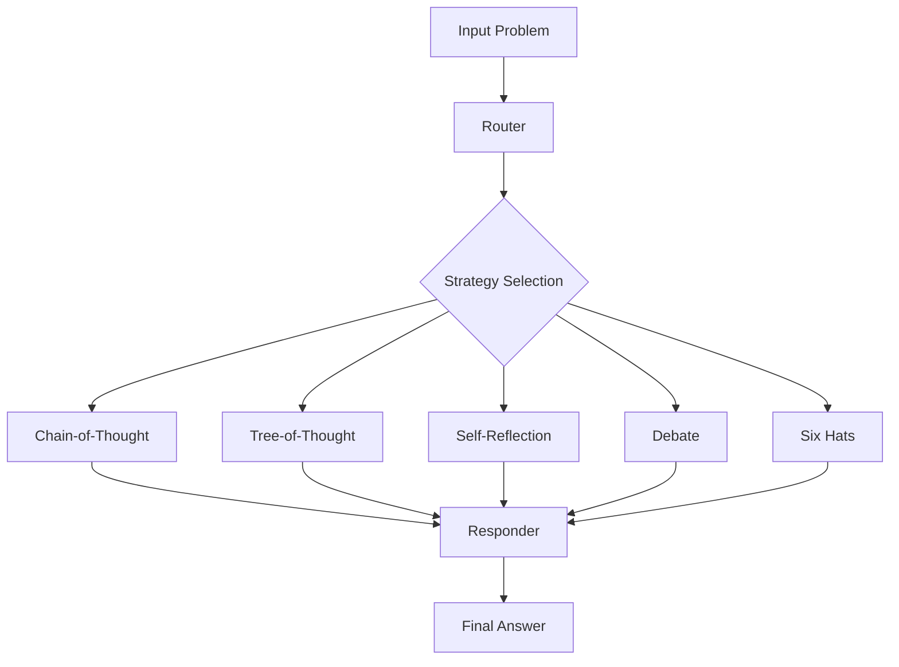

<!-- $ convert logo_large.png -resize 270x270 project_logo.jpg -->

# Reasoning Router: Dynamic Multi-Strategy Reasoning with LangGraph

[]()
[]()
[]()
[]()
[]()
[](./LICENSE.md)

## 🚀 Revolutionize Your AI Reasoning: Unlock Superior Performance with Adaptive Strategy Selection

**Reasoning Router** is a groundbreaking framework that dynamically selects the optimal reasoning strategy for complex problem-solving tasks. By leveraging LangGraph's multi-agent orchestration capabilities, this system achieves **significant accuracy improvements** over traditional single-strategy approaches, making it the future of intelligent AI reasoning.

### ✨ Why Reasoning Router Will Transform Your AI Applications

- **🎯 Adaptive Strategy Selection**: Automatically chooses from Chain-of-Thought, Tree-of-Thought, Self-Reflection, Debate, and Six Hats reasoning methods based on problem complexity
- **📈 Proven Performance Gains**: Demonstrates measurable accuracy improvements on challenging math reasoning benchmarks like GSM8K
- **🔧 Extensible Architecture**: Easily add new reasoning strategies with minimal code changes
- **💾 Stateful Memory**: Maintains conversation context across reasoning steps for coherent, long-form problem solving
- **⚡ LangGraph Powered**: Built on cutting-edge multi-agent orchestration technology for robust, scalable reasoning workflows

## 🏗️ Architecture: How It Works

1. **Router**: Analyzes problem complexity and selects optimal strategy
2. **Strategy Application**: Applies chosen reasoning method to generate detailed thoughts
3. **Responder**: Synthesizes reasoning steps into final answer
4. **State Management**: Maintains context throughout the reasoning process



## 🛠️ Quick Start: Get Reasoning Router Running in Minutes

### Installation

1. **Clone the repository:**
   ```bash
   git clone https://github.com/Pro-GenAI/Reasoning-Router.git
   cd Reasoning-Router
   ```

2. **Install dependencies:**
   ```bash
   pip install -r requirements.txt
   ```

3. **Set up environment variables:**
   ```bash
   cp .env.example .env
   # Edit .env and add your OPENAI_API_KEY
   ```

### Usage

#### Basic Usage

```python
from reasoning_router import graph
from langchain_core.runnables.config import RunnableConfig

# Define your problem
problem = "If a train travels at 60 mph for 2 hours, then 40 mph for 3 hours, what is the average speed?"

# Run the reasoning router
config = RunnableConfig(configurable={"thread_id": "example"})
result = graph.invoke({
    "problem": problem,
    "problem_base": "Solve this complex math problem:",
    "output_format": "Provide the final answer as a number at the end like #### 4",
    "strategy": "",
    "reasoning_steps": [],
    "final_answer": "",
    "messages": []
}, config)

print(f"Selected Strategy: {result['strategy']}")
print(f"Reasoning Steps: {result['reasoning_steps']}")
print(f"Final Answer: {result['final_answer']}")
```

#### Advanced Usage: Custom Strategies

```python
# Add your own reasoning strategy
from langchain_core.prompts import ChatPromptTemplate

CUSTOM_STRATEGY_PROMPT = ChatPromptTemplate.from_messages([
    ("system", "Your custom reasoning approach here..."),
    ("human", "{problem}")
])

# Extend the router logic in reasoning_router.py
```

## 🧪 Evaluation: See the Power in Action

Run comprehensive benchmarks on GSM8K:

```bash
python evaluate_gsm8k.py
```

This will:
- Compare Reasoning Router vs. Direct LLM performance
- Analyze strategy selection patterns
- Generate detailed accuracy metrics

## 🎯 Use Cases: Where Reasoning Router Excels

- **Mathematical Problem Solving**: Complex word problems, multi-step calculations
- **Strategic Decision Making**: Business scenarios requiring diverse perspectives
- **Critical Analysis**: Problems needing self-reflection and bias identification
- **Creative Problem Solving**: Innovation challenges benefiting from multiple viewpoints
- **Educational Applications**: Adaptive tutoring systems with personalized reasoning approaches

---

**Ready to supercharge your AI's reasoning capabilities?** Start with Reasoning Router today and witness the transformation in your applications' problem-solving prowess!
